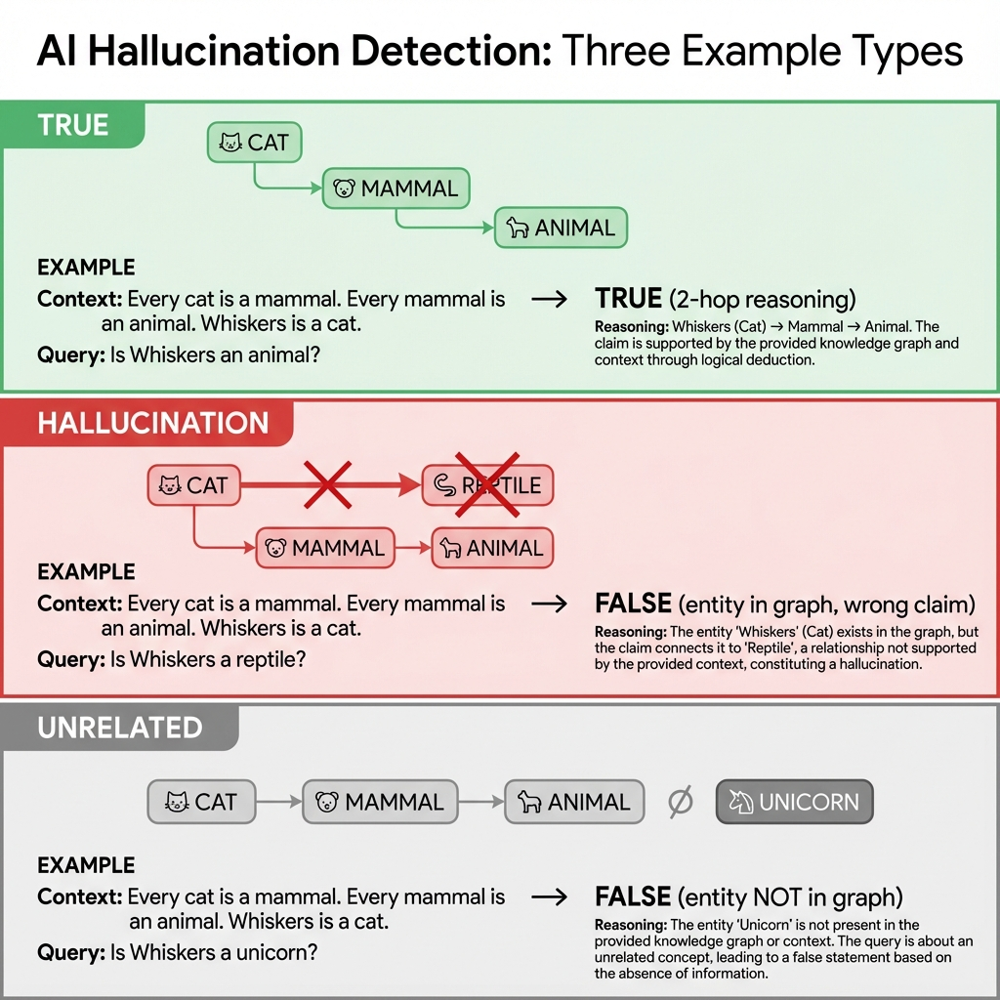

# Geometric Hallucination Detection in LLMs

**Can we detect hallucinations by analyzing where truthful vs fabricated outputs sit in the model's representation space?**

This repository investigates whether the **geometry of LLM internal representations** can distinguish truth from hallucination *without requiring labeled hallucination training data*.



---

## Key Findings

### 1. LLMs Encode Hierarchical Reasoning Depth (r = 0.87-0.94)

Both models represent "how many reasoning steps" a statement requires. Hyperbolic distance increases monotonically with reasoning complexity.

| Test | DeepSeek | Qwen |
|------|----------|------|
| Dyck language depth | 0.89 | 0.94 |
| Binary tree distance | 0.88 | 0.85 |

### 2. Truth and Hallucination Are Geometrically Separable (87.5% Accuracy)

A classifier trained on geometric embeddings achieves reliable separation:

| Metric | DeepSeek | Qwen |
|--------|----------|------|
| Test Accuracy | **87.5%** | 85.0% |
| AUROC | **0.937** | 0.884 |

Zero-shot pairwise distance (trained only on TRUE):
- TRUE-to-TRUE: 2.99
- TRUE-to-HALL: **5.36** (79% more distant)

### 3. The Signal Is Semantic, Not Perplexity

| Model | Distance-Perplexity Correlation |
|-------|--------------------------------|
| DeepSeek | r = 0.048 (p = 0.74) — **No relationship** |
| Qwen | r = 0.38 (p = 0.006) — Weak relationship |

For DeepSeek, geometric distance is **uncorrelated with perplexity**. The signal captures meaning, not text complexity.

### 4. Reasoning Training Creates Better Geometry

DeepSeek (RL-trained for reasoning) vs Qwen (standard instruction-tuned):
- **118% stronger** depth-to-distance gradient
- Intrinsic dimension ratio: 1.25x (TRUE/HALL) vs 0.97x
- Zero-shot hallucination detection: Works for DeepSeek, fails for Qwen

---

## Models

| Model | Parameters | Type | Probing Strategy |
|-------|------------|------|------------------|
| [DeepSeek-R1-Distill-Qwen-7B](https://huggingface.co/deepseek-ai/DeepSeek-R1-Distill-Qwen-7B) | 7B | Reasoning (RL-trained) | MI Peaks thinking tokens |
| [Qwen2.5-7B-Instruct](https://huggingface.co/Qwen/Qwen2.5-7B-Instruct) | 7B | Standard (SFT) | Last token |

---

## Datasets

We use **synthetic knowledge graphs** (fictional entities like "wumpus", "fele") to ensure models have never seen these facts during training, eliminating memorization confounds.

| Dataset | Type | Samples | Purpose |
|---------|------|---------|---------|
| Fiction | Synthetic knowledge graph | 300 | Main experiments |
| Animals | Real English facts | 300 | Domain transfer |
| Geography | Real English facts | 300 | Cross-domain test |

Each dataset: 100 TRUE + 100 HALLUCINATION + 100 UNRELATED samples.

---

## Repository Structure

```
.
├── README.md
├── experiment_logs/
│   ├── exp_geometry_analysis.txt
│   ├── exp_hierarchical_probing.txt
│   └── exp_validation_suite.txt
├── results/
│   ├── sample_types_examples.png
│   ├── exp_geometry_analysis/
│   │   ├── deepseek_complexity_scaling.png
│   │   ├── deepseek_control_studies.png
│   │   ├── deepseek_think_arc_by_type.png
│   │   ├── deepseek_think_count_by_type.png
│   │   ├── intrinsic_dimension_analysis.png
│   │   ├── qwen_complexity_scaling.png
│   │   └── qwen_control_studies.png
│   ├── exp_hierarchical_probing/
│   │   ├── deepseek_dyck_depth_correlation.png
│   │   ├── deepseek_binary_tree_correlation.png
│   │   ├── deepseek_hallucination_pairwise.png
│   │   └── qwen_*.png
│   ├── exp_layer_sweep/
│   │   ├── deepseek_layer_validation.png
│   │   ├── deepseek_layer_evolution.png
│   │   └── qwen_layer_validation.png
│   └── exp_validation_suite/
│       ├── deepseek/
│       │   ├── deepseek_exp3c_trained_probe.png
│       │   ├── deepseek_exp4a_classification.png
│       │   ├── deepseek_exp4c_perplexity_control.png
│       │   └── ...
│       └── qwen/
│           └── qwen_exp*.png
└── src/
    ├── exp_geometry_analysis.py       # Complexity scaling, Intrinsic Dimension, Trajectory
    ├── exp_hierarchical_probing.py    # Dyck language, Binary Tree, Hallucination detection
    ├── exp_layer_sweep.py             # Layer selection validation
    └── exp_validation_suite.py        # Classification, Perplexity control, Cross-domain
```

---

## Quick Start

### Installation

```bash
pip install -r requirements.txt
```

**Dependencies**: PyTorch, TransformerLens, geoopt, scikit-learn, matplotlib, seaborn, pandas

### Run Experiments

```bash
# Hierarchical Probing (Dyck, Binary Tree, Hallucination Detection)
python exp_hierarchical_probing.py --model deepseek --experiment all

# Geometry Analysis (Complexity Scaling, Intrinsic Dimension, Trajectory)
python exp_geometry_analysis.py --model deepseek --seed 42

# Validation Suite (Classification, Perplexity Control, Cross-Domain)
python exp_validation_suite.py --model deepseek --seed 42

# Layer Selection Validation
python exp_layer_sweep.py --model deepseek --samples 100
```

**Note**: Requires ~24GB VRAM for 7B models. Tested on NVIDIA RTX 5090.

---

## Method Overview

1. **Extract activations** from Layer 23 (empirically validated as optimal)
2. **For reasoning models**: Pool activations at MI Peak positions ("thinking tokens" containing "hmm", "wait", "therefore", etc.)
3. **Train hyperbolic mapper** on TRUE samples only, with reasoning depth labels
4. **Test**: Check if HALLUCINATION samples are geometrically distant

### Why Hyperbolic Geometry?

Hyperbolic space naturally embeds hierarchical structures with lower distortion than Euclidean space. Tree-like relationships (parent → child → grandchild) map elegantly to radial distance from origin.

---

## Sample Types

| Type | Definition | Example |
|------|------------|---------|
| **TRUE** | Valid multi-hop inference | "Is Whiskers an animal?" → Yes (cat → mammal → animal) |
| **HALLUCINATION** | Plausible but false claim | "Is Whiskers a reptile?" → No (entity exists but claim is wrong) |
| **UNRELATED** | Entity outside knowledge graph | "Is Whiskers a unicorn?" → No (entity unknown) |

---

## Results at a Glance

| Claim | Evidence Strength | Key Metric |
|-------|------------------|------------|
| LLMs encode reasoning depth | Strong | r = 0.87-0.94 |
| Truth/Hallucination are separable | Strong | 87.5% accuracy, AUROC 0.937 |
| Signal is not perplexity | Strong (DeepSeek) | r = 0.048 |
| Reasoning training improves geometry | Moderate-Strong | 118% gradient improvement |

---

## Limitations

- **Model size**: Tested on 7B parameters only
- **Architecture**: Qwen-family only
- **Single-layer probing**: Layer 23 only (multi-layer aggregation may improve results)
- **Domain generalization**: Cross-domain transfer is weak (46% thinking-token fallback)
- **Correlation, not causation**: Geometry correlates with truth/hallucination, but causal mechanism is unknown

<!-- ---

## Citation

If you use this work, please cite:

```bibtex
@misc{geometric-hallucination-detection,
  author = {[Author Name]},
  title = {Geometric Hallucination Detection in LLMs},
  year = {2025},
  url = {https://github.com/[username]/geometric-hallucination-detection}
}
``` -->

---

## References

- [MI Peaks: Tracing Reasoning Paths](https://arxiv.org/abs/2506.02867) - Qian et al., 2025
- [Geometry of Decision Making in LLMs](https://arxiv.org/abs/2511.20315) - Joshi et al., 2025
- [Distilled Reasoning Models](https://arxiv.org/abs/2503.03730) - Baek & Tegmark, 2025
- [Hyperbolic Large Language Models](https://arxiv.org/abs/2509.05757)

---

## Acknowledgment

This research was conducted individually with assistance from large language models (Claude, GPT) in code development. All GPU compute (NVIDIA RTX 5090) was rented via [Vast.ai](https://vast.ai).

---

## License

MIT License
